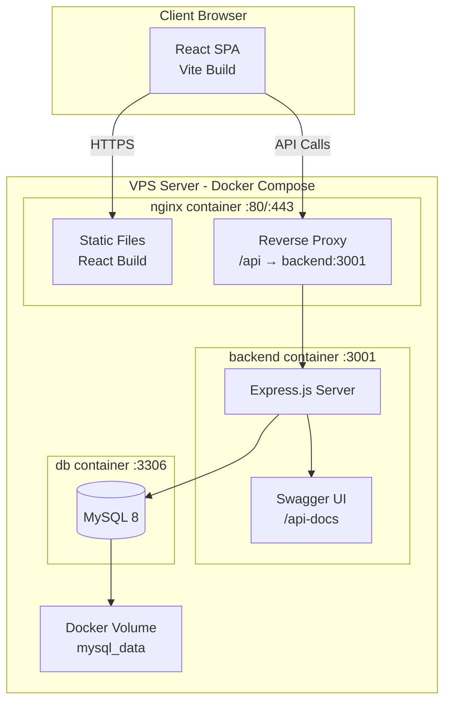
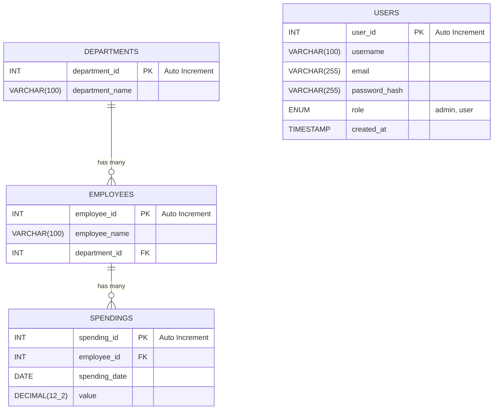
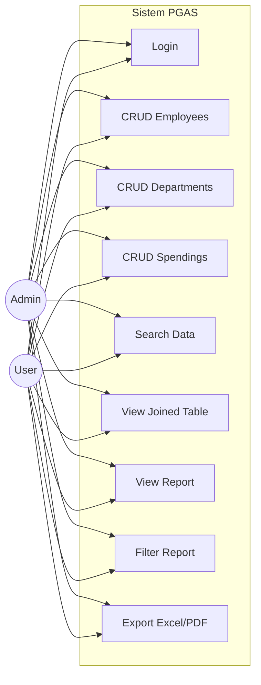
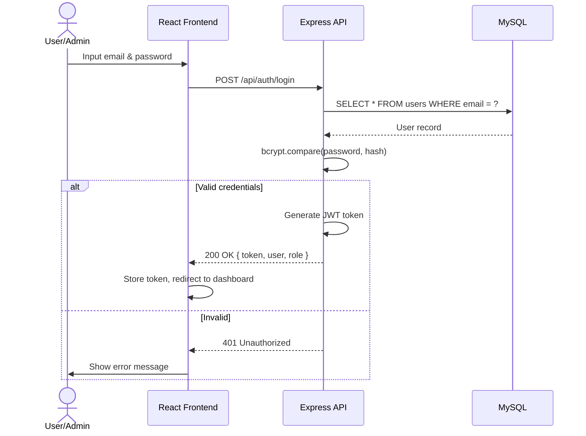

# PRD — PGAS Solution Programmer Test

## 1. Ringkasan Proyek

Proyek ini adalah pengerjaan **Soal Test Pemrograman ICT PT PGAS Solution** yang mencakup pembuatan sistem manajemen data karyawan, departemen, dan pengeluaran (spending). Sistem dibangun **full-stack JavaScript** dengan arsitektur modern, di-deploy di **VPS + domain** agar hasil tes dapat diakses online, sekaligus dikirim via email.

> [!IMPORTANT]
> **Authentication Microsoft EntraID diabaikan** sesuai permintaan. Sistem autentikasi menggunakan JWT berbasis custom login (email/password).

---

## 2. Tujuan & Showcase Skill

Proyek ini dirancang untuk mendemonstrasikan kompetensi berikut sesuai kebutuhan rekrutmen:

| Kompetensi | Implementasi |
|---|---|
| **OOP** | Class-based models, service layer pattern, inheritance pada role-based access |
| **UML** | ERD, Use Case Diagram, Sequence Diagram (didokumentasikan di `/docs`) |
| **Git** | Conventional commits, branching strategy, clean history, GitHub repository |
| **MySQL** | Bare query (raw SQL), stored procedures, proper indexing, seeding |
| **React** | Frontend SPA dengan React + Vite |
| **Power BI** | Dashboard embed atau export-ready data format untuk Power BI |
| **Linux (NGINX)** | Deployment di VPS dengan NGINX reverse proxy + SSL |
| **Full JavaScript** | Node.js (Express) backend + React frontend, end-to-end JS |
| **Dokumentasi** | Swagger (OpenAPI), JSDoc, UML diagrams, README profesional |

---

## 3. Tech Stack

### 3.1 Backend
| Layer | Teknologi |
|---|---|
| Runtime | **Node.js** (LTS) |
| Framework | **Express.js** |
| Database | **MySQL 8** |
| ORM/Query | **Raw SQL (Bare Query)** via `mysql2` — sesuai instruksi soal |
| Auth | **JWT** (jsonwebtoken + bcryptjs) |
| Validation | **Joi** atau **express-validator** |
| API Docs | **Swagger UI Express** + swagger-jsdoc (OpenAPI 3.0) |
| Testing | **Jest** + **Supertest** |

### 3.2 Frontend
| Layer | Teknologi |
|---|---|
| Framework | **React 18** + **Vite** |
| Routing | **React Router v6** |
| State Management | **React Context** + hooks |
| HTTP Client | **Axios** |
| Styling | **TailwindCSS v4** |
| UI Components | **shadcn/ui** (Radix primitives + Tailwind) |
| Tabel Data | **shadcn/ui DataTable** (TanStack Table) — sorting, filtering, pagination |
| Charts/Report | **Recharts** (untuk visualisasi spending) |
| Export | **xlsx** (SheetJS) untuk Excel, **jsPDF** + **jspdf-autotable** untuk PDF |
| Filter UI | shadcn Select (dropdown), shadcn Slider (range), shadcn Input (min-max) |

### 3.3 DevOps & Infrastructure
| Layer | Teknologi |
|---|---|
| Container | **Docker** + **Docker Compose** |
| Server | **VPS** (milik user) |
| Web Server | **NGINX** (containerized, reverse proxy + static serving) |
| SSL | **Let's Encrypt** (certbot) |
| Database | **MySQL 8** (Docker container — tidak perlu install manual) |
| Version Control | **Git** + **GitHub** |
| CI/CD | **GitHub Actions** (opsional, auto-deploy on push) |

### 3.4 Dokumentasi
| Aspek | Tools |
|---|---|
| API Docs | **Swagger UI** (endpoint `/api-docs`) |
| UML Diagrams | **Mermaid** / **draw.io** (ERD, Use Case, Sequence) |
| Code Docs | **JSDoc** comments |
| README | Panduan setup, screenshot, link demo |
| Database | SQL migration files + seed files terdokumentasi |

---

## 4. Arsitektur Sistem

### 4.1 High-Level Architecture



### 4.2 Folder Structure

```
PGAS-TEST/
├── docs/                          # Dokumentasi UML, screenshot
│   ├── uml/
│   │   ├── erd.md                 # Entity Relationship Diagram (Mermaid)
│   │   ├── use-case.md            # Use Case Diagram
│   │   └── sequence.md            # Sequence Diagram
│   ├── screenshots/               # Screenshot hasil query & UI
│   └── power-bi/                  # Power BI template/export
│
├── database/                      # SQL files
│   ├── migrations/
│   │   └── 001_create_tables.sql
│   ├── seeds/
│   │   └── 001_seed_data.sql
│   └── queries/
│       ├── select_all.sql
│       ├── join_query.sql
│       ├── sorted_spending.sql
│       └── filtered_report.sql
│
├── backend/                       # Express.js API
│   ├── src/
│   │   ├── config/
│   │   │   ├── database.js        # MySQL connection pool
│   │   │   └── swagger.js         # Swagger/OpenAPI config
│   │   ├── models/                # OOP class-based models
│   │   │   ├── Department.js
│   │   │   ├── Employee.js
│   │   │   ├── Spending.js
│   │   │   └── User.js
│   │   ├── services/              # Business logic layer
│   │   │   ├── DepartmentService.js
│   │   │   ├── EmployeeService.js
│   │   │   ├── SpendingService.js
│   │   │   └── AuthService.js
│   │   ├── controllers/           # Request handlers
│   │   │   ├── departmentController.js
│   │   │   ├── employeeController.js
│   │   │   ├── spendingController.js
│   │   │   └── authController.js
│   │   ├── middlewares/
│   │   │   ├── authMiddleware.js   # JWT verification
│   │   │   └── roleMiddleware.js   # Role-based access control
│   │   ├── routes/
│   │   │   ├── departmentRoutes.js
│   │   │   ├── employeeRoutes.js
│   │   │   ├── spendingRoutes.js
│   │   │   └── authRoutes.js
│   │   ├── utils/
│   │   │   └── queryBuilder.js    # Raw SQL helpers
│   │   └── app.js                 # Express app setup
│   ├── tests/                     # Jest + Supertest
│   ├── package.json
│   └── .env.example
│
├── frontend/                      # React + Vite
│   ├── src/
│   │   ├── components/
│   │   │   ├── Layout/
│   │   │   ├── DataTable/
│   │   │   ├── SearchBar/
│   │   │   ├── FilterPanel/
│   │   │   ├── ExportButton/
│   │   │   └── AccessDeniedAlert/
│   │   ├── pages/
│   │   │   ├── LoginPage.jsx
│   │   │   ├── DashboardPage.jsx
│   │   │   ├── EmployeesPage.jsx
│   │   │   ├── DepartmentsPage.jsx
│   │   │   ├── SpendingsPage.jsx
│   │   │   └── ReportPage.jsx
│   │   ├── contexts/
│   │   │   └── AuthContext.jsx
│   │   ├── services/
│   │   │   └── api.js             # Axios instance
│   │   ├── hooks/
│   │   │   ├── useAuth.js
│   │   │   └── usePermission.js
│   │   ├── utils/
│   │   │   ├── exportExcel.js
│   │   │   └── exportPdf.js
│   │   ├── App.jsx
│   │   └── main.jsx
│   ├── public/
│   ├── package.json
│   └── vite.config.js
│
├── docker/                        # Docker configs
│   └── nginx/
│       └── default.conf           # NGINX site config
│
├── docker-compose.yml             # Orchestrasi semua container
├── docker-compose.prod.yml        # Override untuk production
├── Dockerfile.backend             # Backend image
├── Dockerfile.frontend            # Frontend multi-stage build
├── .dockerignore
├── PRD.md                         # Dokumen ini
├── README.md                      # Panduan lengkap
├── .gitignore
└── .env.example                   # Template environment variables
```

---

## 5. Database Design

### 5.1 Entity Relationship Diagram



> [!NOTE]
> Tabel `USERS` ditambahkan untuk kebutuhan autentikasi (login + role-based access). Ini bukan bagian dari soal asli tetapi diperlukan untuk implementasi fitur login.

### 5.2 SQL Queries (Bare Query — Sesuai Instruksi Soal)

Semua query disimpan di folder `database/queries/` dan didokumentasikan dengan screenshot hasil eksekusi:

1. **SELECT ALL** — Menampilkan seluruh data masing-masing tabel
2. **JOIN** — Gabungan employees + departments + spendings
3. **ORDER BY** — Sorting berdasarkan spending value (ASC)
4. **FILTERED REPORT** — Spending tahun 2020–2025, bulan Jan–Des, filter range value

---

## 6. Fitur Aplikasi

### 6.1 Authentication & Authorization

| Fitur | Detail |
|---|---|
| Login | Form email/password, JWT token |
| Role: **Admin** | Full CRUD pada semua entitas |
| Role: **User** | Create + Read saja |
| Access Denied | Alert: *"Akses ditolak: Hanya Admin yang dapat melakukan aksi ini."* |

### 6.2 CRUD — Data Management

#### Employees
- [Admin] Create, Read, Update, Delete
- [User] Create, Read
- Search by nama karyawan

#### Departments
- [Admin] Create, Read, Update, Delete
- [User] Create, Read
- Search by nama departemen

#### Spendings
- [Admin] Create, Read, Update, Delete
- [User] Create, Read

### 6.3 Data Table — Gabungan (JOIN)

Tabel menampilkan data gabungan:

| Kolom | Source |
|---|---|
| Nama Karyawan | employees.employee_name |
| Nama Departemen | departments.department_name |
| Tanggal Pengeluaran | spendings.spending_date |
| Nilai Pengeluaran | spendings.value |

- Default sort: `value ASC` (terkecil → terbesar)
- Fitur search: by employee name & department name
- Pagination

### 6.4 Laporan Pengeluaran (Spending Report)

| Aspek | Detail |
|---|---|
| Periode | 2020 – tahun terbaru |
| Bulan | Januari – Desember |
| Kolom | Tanggal pengeluaran, Nilai pengeluaran |
| **Filter** | |
| — Dropdown | Pilih tahun/bulan tertentu |
| — Slider | Range nilai pengeluaran (min–max) |
| — Input angka | Manual input range min–max |
| **Export** | |
| — Excel (.xlsx) | Via SheetJS library |
| — PDF (.pdf) | Via jsPDF + jspdf-autotable |

### 6.5 Power BI Ready

- Endpoint API yang mengembalikan data dalam format JSON flat (Power BI compatible)
- Opsional: Sediakan file `.pbix` template atau koneksi guide
- Data bisa di-import ke Power BI Desktop via REST API connector

---

## 7. API Design (RESTful)

### 7.1 Auth Endpoints

| Method | Endpoint | Description | Access |
|---|---|---|---|
| POST | `/api/auth/login` | Login, return JWT | Public |
| POST | `/api/auth/register` | Register user baru | Public |
| GET | `/api/auth/me` | Get current user info | Authenticated |

### 7.2 Department Endpoints

| Method | Endpoint | Description | Access |
|---|---|---|---|
| GET | `/api/departments` | List all departments | User, Admin |
| GET | `/api/departments/:id` | Get department by ID | User, Admin |
| POST | `/api/departments` | Create department | User, Admin |
| PUT | `/api/departments/:id` | Update department | Admin only |
| DELETE | `/api/departments/:id` | Delete department | Admin only |

### 7.3 Employee Endpoints

| Method | Endpoint | Description | Access |
|---|---|---|---|
| GET | `/api/employees` | List all (+ search query) | User, Admin |
| GET | `/api/employees/:id` | Get employee by ID | User, Admin |
| POST | `/api/employees` | Create employee | User, Admin |
| PUT | `/api/employees/:id` | Update employee | Admin only |
| DELETE | `/api/employees/:id` | Delete employee | Admin only |

### 7.4 Spending Endpoints

| Method | Endpoint | Description | Access |
|---|---|---|---|
| GET | `/api/spendings` | List all spendings | User, Admin |
| GET | `/api/spendings/:id` | Get spending by ID | User, Admin |
| POST | `/api/spendings` | Create spending | User, Admin |
| PUT | `/api/spendings/:id` | Update spending | Admin only |
| DELETE | `/api/spendings/:id` | Delete spending | Admin only |

### 7.5 Report & Data Endpoints

| Method | Endpoint | Description | Access |
|---|---|---|---|
| GET | `/api/reports/spendings` | Joined data + filters | User, Admin |
| GET | `/api/reports/spendings/export/excel` | Download Excel | User, Admin |
| GET | `/api/reports/spendings/export/pdf` | Download PDF | User, Admin |
| GET | `/api/reports/power-bi` | Flat JSON for Power BI | User, Admin |

### 7.6 Swagger Documentation

- **Endpoint**: `GET /api-docs`
- Semua endpoint didokumentasikan lengkap dengan:
  - Request body schema
  - Response schema
  - Auth requirements
  - Example values
  - Error responses

---

## 8. UML Diagrams

Semua diagram disimpan di `docs/uml/` menggunakan format Mermaid (render di GitHub) atau export PNG.

### 8.1 Use Case Diagram



> [!NOTE]
> User memiliki akses terbatas: hanya **Create & Read** pada UC2, UC3, UC4. Attempt ke Update/Delete akan ditolak dengan alert.

### 8.2 Sequence Diagram — Login Flow



---

## 9. Deployment Plan (Docker Compose)

> [!TIP]
> Semua service (NGINX, Express, MySQL) berjalan di Docker container. **Tidak perlu install MySQL, Node.js, atau NGINX secara manual** di VPS — cukup install Docker & Docker Compose.

### 9.1 Docker Architecture

```
Domain → DNS A Record → VPS IP
                          │
              ┌───────────┴───────────┐
              │   Docker Compose      │
              │                       │
              │  ┌─────────────────┐  │
              │  │  nginx (container) │  │
              │  │  :80 / :443     │  │
              │  │  SSL termination │  │
              │  │  /  → React SPA │  │
              │  │  /api → backend │  │
              │  └────────┬────────┘  │
              │           │           │
              │  ┌────────┴────────┐  │
              │  │ backend (container)│  │
              │  │ Express.js :3001 │  │
              │  │ Swagger /api-docs│  │
              │  └────────┬────────┘  │
              │           │           │
              │  ┌────────┴────────┐  │
              │  │  db (container)  │  │
              │  │  MySQL 8 :3306   │  │
              │  │  Volume: data    │  │
              │  └─────────────────┘  │
              │                       │
              └───────────────────────┘
```

### 9.2 Docker Compose (docker-compose.yml)

```yaml
version: '3.8'

services:
  db:
    image: mysql:8.0
    restart: always
    environment:
      MYSQL_ROOT_PASSWORD: ${DB_ROOT_PASSWORD}
      MYSQL_DATABASE: ${DB_NAME}
      MYSQL_USER: ${DB_USER}
      MYSQL_PASSWORD: ${DB_PASSWORD}
    volumes:
      - mysql_data:/var/lib/mysql
      - ./database/migrations:/docker-entrypoint-initdb.d/01-migrations
      - ./database/seeds:/docker-entrypoint-initdb.d/02-seeds
    ports:
      - "3306:3306"
    networks:
      - pgas-network
    healthcheck:
      test: ["CMD", "mysqladmin", "ping", "-h", "localhost"]
      interval: 10s
      timeout: 5s
      retries: 5

  backend:
    build:
      context: .
      dockerfile: Dockerfile.backend
    restart: always
    environment:
      DB_HOST: db
      DB_PORT: 3306
      DB_NAME: ${DB_NAME}
      DB_USER: ${DB_USER}
      DB_PASSWORD: ${DB_PASSWORD}
      JWT_SECRET: ${JWT_SECRET}
      NODE_ENV: production
    ports:
      - "3001:3001"
    depends_on:
      db:
        condition: service_healthy
    networks:
      - pgas-network

  nginx:
    image: nginx:alpine
    restart: always
    ports:
      - "80:80"
      - "443:443"
    volumes:
      - ./docker/nginx/default.conf:/etc/nginx/conf.d/default.conf
      - ./frontend/dist:/usr/share/nginx/html
      - ./certbot/conf:/etc/letsencrypt
      - ./certbot/www:/var/www/certbot
    depends_on:
      - backend
    networks:
      - pgas-network

  certbot:
    image: certbot/certbot
    volumes:
      - ./certbot/conf:/etc/letsencrypt
      - ./certbot/www:/var/www/certbot
    entrypoint: "/bin/sh -c 'trap exit TERM; while :; do certbot renew; sleep 12h & wait $${!}; done;'"

volumes:
  mysql_data:

networks:
  pgas-network:
    driver: bridge
```

### 9.3 NGINX Config (docker/nginx/default.conf)

```nginx
upstream backend {
    server backend:3001;
}

server {
    listen 80;
    server_name pgas.heyfik.net;

    # Certbot challenge
    location /.well-known/acme-challenge/ {
        root /var/www/certbot;
    }

    location / {
        return 301 https://$server_name$request_uri;
    }
}

server {
    listen 443 ssl http2;
    server_name pgas.heyfik.net;

    ssl_certificate /etc/letsencrypt/live/pgas.heyfik.net/fullchain.pem;
    ssl_certificate_key /etc/letsencrypt/live/pgas.heyfik.net/privkey.pem;

    # React Frontend (static)
    root /usr/share/nginx/html;
    index index.html;

    location / {
        try_files $uri $uri/ /index.html;
    }

    # API Proxy
    location /api {
        proxy_pass http://backend;
        proxy_http_version 1.1;
        proxy_set_header Upgrade $http_upgrade;
        proxy_set_header Connection 'upgrade';
        proxy_set_header Host $host;
        proxy_set_header X-Real-IP $remote_addr;
        proxy_set_header X-Forwarded-For $proxy_add_x_forwarded_for;
        proxy_set_header X-Forwarded-Proto $scheme;
        proxy_cache_bypass $http_upgrade;
    }

    # Swagger Docs
    location /api-docs {
        proxy_pass http://backend;
        proxy_set_header Host $host;
        proxy_set_header X-Real-IP $remote_addr;
    }
}
```

### 9.4 Dockerfiles

**Dockerfile.backend**
```dockerfile
FROM node:20-alpine
WORKDIR /app
COPY backend/package*.json ./
RUN npm ci --only=production
COPY backend/ .
EXPOSE 3001
CMD ["node", "src/app.js"]
```

**Dockerfile.frontend** (multi-stage build)
```dockerfile
FROM node:20-alpine AS build
WORKDIR /app
COPY frontend/package*.json ./
RUN npm ci
COPY frontend/ .
RUN npm run build

# Output: /app/dist → di-mount ke nginx container
```

### 9.5 Deployment Steps

1. SSH ke VPS
2. Install **Docker** & **Docker Compose** (satu-satunya dependency)
3. Clone repo dari GitHub
4. Copy `.env.example` → `.env`, isi credentials
5. Build frontend: `docker compose run --rm frontend npm run build` (atau build lokal)
6. Start semua services: `docker compose up -d`
7. Setup SSL: `docker compose run --rm certbot certonly --webroot -w /var/www/certbot -d pgas.heyfik.net`
8. Restart nginx: `docker compose restart nginx`
9. Test akses via domain

**Update/Redeploy:**
```bash
git pull origin main
docker compose down
docker compose up -d --build
```

---

## 10. Git Strategy

```
main ← production branch
  └── develop ← integration branch
        ├── feature/database-setup
        ├── feature/backend-auth
        ├── feature/backend-crud
        ├── feature/backend-reports
        ├── feature/frontend-login
        ├── feature/frontend-crud
        ├── feature/frontend-report
        ├── feature/swagger-docs
        └── feature/deployment
```

- **Conventional Commits**: `feat:`, `fix:`, `docs:`, `chore:`, `refactor:`
- Setiap feature branch di-merge ke `develop` via PR
- Final merge `develop` → `main` untuk deployment

---

## 11. Pengumpulan Hasil Test

### 11.1 Via Email

Kirim ke alamat yang ditentukan di soal:
- **To**: ap.firmansyah@pgnsolution.co.id
- **CC**: famardi.raffly@pgnsolution.co.id, fatih.rahman@pgnsolution.co.id, fatimah.winarno@pgnsolution.co.id, irvan.hilmi@pgnsolution.co.id, haliza.rizkianti@pgnsolution.co.id

Isi email:
- Link GitHub repository
- Link live demo (domain)
- Screenshot database queries
- Penjelasan singkat arsitektur

### 11.2 Via Web (Live Demo)

- Aplikasi accessible di `https://pgas.heyfik.net`
- Swagger docs di `https://pgas.heyfik.net/api-docs`
- Credential demo:
  - Admin: `admin@pgastest.com` / `admin123`
  - User: `user@pgastest.com` / `user123`

---

## 12. Checklist Deliverables

| # | Deliverable | Status |
|---|---|---|
| 1 | Database: 3 tabel (Departments, Employees, Spendings) | ⬜ |
| 2 | Database: Dummy data (seed) | ⬜ |
| 3 | Database: Query SELECT ALL | ⬜ |
| 4 | Database: Query JOIN 3 tabel | ⬜ |
| 5 | Database: Query ORDER BY value ASC | ⬜ |
| 6 | Database: Query filtered report 2020–2025 | ⬜ |
| 7 | Database: Screenshot semua query results | ⬜ |
| 8 | Backend: Express.js REST API | ⬜ |
| 9 | Backend: JWT Authentication | ⬜ |
| 10 | Backend: Role-based access (Admin/User) | ⬜ |
| 11 | Backend: CRUD endpoints (all entities) | ⬜ |
| 12 | Backend: Report endpoint + filters | ⬜ |
| 13 | Backend: Export Excel & PDF | ⬜ |
| 14 | Backend: Swagger API documentation | ⬜ |
| 15 | Frontend: Login page | ⬜ |
| 16 | Frontend: Dashboard | ⬜ |
| 17 | Frontend: CRUD pages (3 entities) | ⬜ |
| 18 | Frontend: Search (employee & department) | ⬜ |
| 19 | Frontend: Joined data table (sorted) | ⬜ |
| 20 | Frontend: Report page + filters (dropdown, slider, input) | ⬜ |
| 21 | Frontend: Export buttons (Excel, PDF) | ⬜ |
| 22 | Frontend: Access denied alert (User → Update/Delete) | ⬜ |
| 23 | Docs: UML diagrams (ERD, Use Case, Sequence) | ⬜ |
| 24 | Docs: README.md profesional | ⬜ |
| 25 | Docs: Screenshot database queries | ⬜ |
| 26 | Deployment: Docker Compose (NGINX + MySQL + Backend) | ⬜ |
| 27 | Deployment: SSL via Certbot container | ⬜ |
| 28 | Git: Clean history, conventional commits | ⬜ |
| 29 | Power BI: Data export/template | ⬜ |
| 30 | Email: Kirim ke semua recipient | ⬜ |

---

## Deadline

> [!CAUTION]
> **Deadline: Jumat, 25 Juli 2026 pukul 23:59 WIB**
> Waktu tersisa: **~2 hari** dari sekarang (24 Juli 2026).

## Resolved Decisions

| Pertanyaan | Keputusan |
|---|---|
| Domain & VPS | **pgas.heyfik.net** → `43.129.57.220` |
| Database hosting | **Docker container** — MySQL 8 berjalan di container, tidak perlu install manual |
| Dummy data | **Bebas** — volume data fleksibel, yang penting representatif |
| Deployment | **Docker Compose** — semua service (NGINX, Express, MySQL) dalam container |
| Authentication | **JWT custom** — Microsoft EntraID diabaikan |
| UI Framework | **TailwindCSS + shadcn/ui** (Radix primitives) |
| Power BI | **API endpoint only** — flat JSON format yang bisa di-import ke Power BI Desktop |

---

## Verification Plan

### Automated Tests
- `npm test` — Jest + Supertest untuk semua API endpoints
- Lint check: `npm run lint` (ESLint)

### Manual Verification
- Akses semua halaman via browser
- Test login sebagai Admin dan User
- Verifikasi akses ditolak saat User coba Update/Delete
- Test search, filter, sort functionality
- Test export Excel dan PDF
- Verifikasi Swagger docs lengkap
- Test akses live demo via domain
