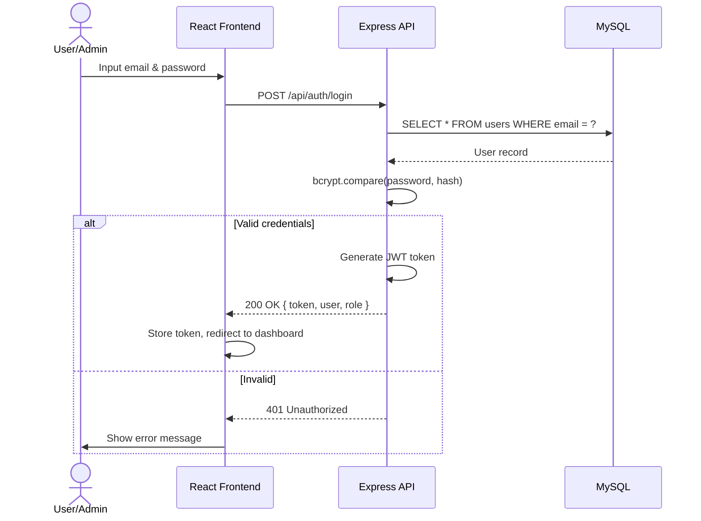
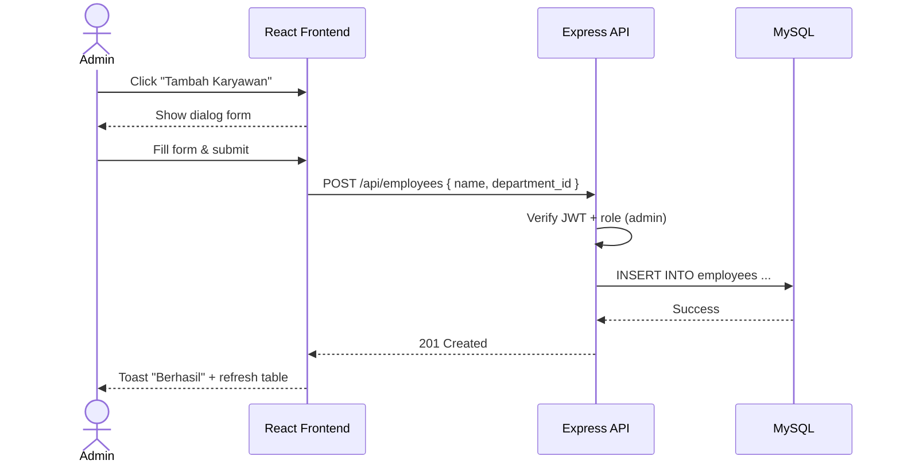
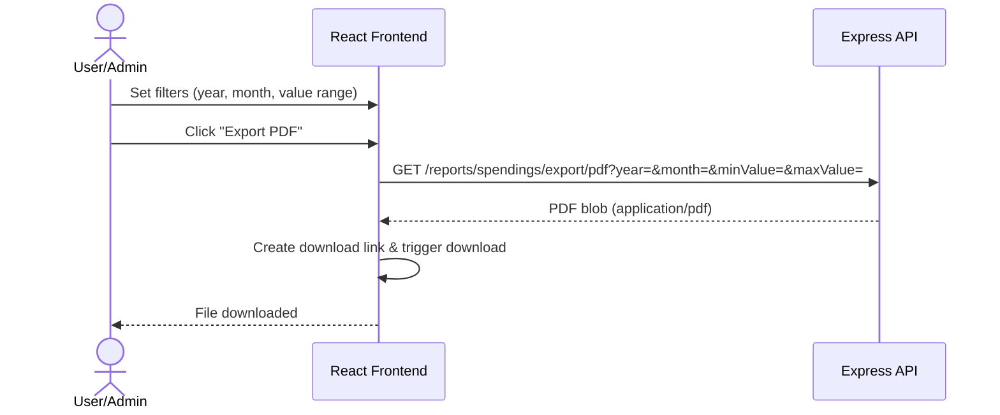

# Sequence Diagrams

## 1. Login Flow

```mermaid
sequenceDiagram
    actor U as User/Admin
    participant F as React Frontend
    participant A as Express API
    participant DB as MySQL

    U->>F: Input email & password
    F->>A: POST /api/auth/login
    A->>DB: SELECT * FROM users WHERE email = ?
    DB-->>A: User record
    A->>A: bcrypt.compare(password, hash)
    alt Valid credentials
        A->>A: Generate JWT token
        A-->>F: 200 OK { token, user, role }
        F->>F: Store token, redirect to dashboard
    else Invalid
        A-->>F: 401 Unauthorized
        F->>U: Show error message
    end
```

## 2. CRUD Employee (Admin Create)

```mermaid
sequenceDiagram
    actor A as Admin
    participant F as React Frontend
    participant API as Express API
    participant DB as MySQL

    A->>F: Click "Tambah Karyawan"
    F-->>A: Show dialog form
    A->>F: Fill form & submit
    F->>API: POST /api/employees { name, department_id }
    API->>API: Verify JWT + role (admin)
    API->>DB: INSERT INTO employees ...
    DB-->>API: Success
    API-->>F: 201 Created
    F-->>A: Toast "Berhasil" + refresh table
```

## 3. Export Report PDF

```mermaid
sequenceDiagram
    actor U as User/Admin
    participant F as React Frontend
    participant API as Express API

    U->>F: Set filters (year, month, value range)
    U->>F: Click "Export PDF"
    F->>API: GET /reports/spendings/export/pdf?year=&month=&minValue=&maxValue=
    API-->>F: PDF blob (application/pdf)
    F->>F: Create download link & trigger download
    F-->>U: File downloaded
```
