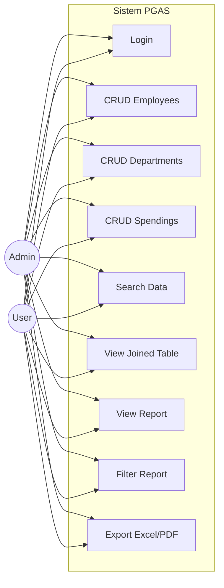

# Use Case Diagram

## Role-Based Access

| Fitur | Admin | User |
|-------|-------|------|
| CRUD Employees | Full (Create, Read, Update, Delete) | Create & Read only |
| CRUD Departments | Full | Create & Read only |
| CRUD Spendings | Full | Create & Read only |
| Search | ✅ | ✅ |
| View Joined Table | ✅ | ✅ |
| View Report | ✅ | ✅ |
| Filter Report | ✅ | ✅ |
| Export Excel/PDF | ✅ | ✅ |
